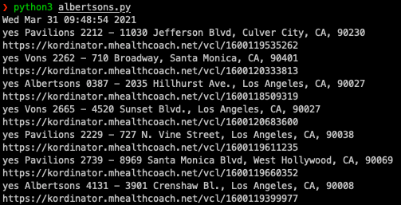

# Albertsons Vaccine Checker
A basic python script to check Albertson and Albertson subsidiaries for available COVID vaccine appointments

# How to use
Modify `locs` to include the zip codes you wish to check. For Los Angeles, I pulled the zip codes in the regions I wanted from https://www.usmapguide.com/california/los-angeles-zip-code-map/

By default, the script will run once every ten minutes, for three hours. The script will BEEP once regardless of how many locations with available appointments it finds. If a location with availability is found, the location's signup link is printed. 

This was written very quickly and hits an AWS endpoint. If it stops working, a new AWS endpoint can be grabbed from https://www.mhealthappointments.com/covidappt

# Requirements
`python3`\
`beepy`
